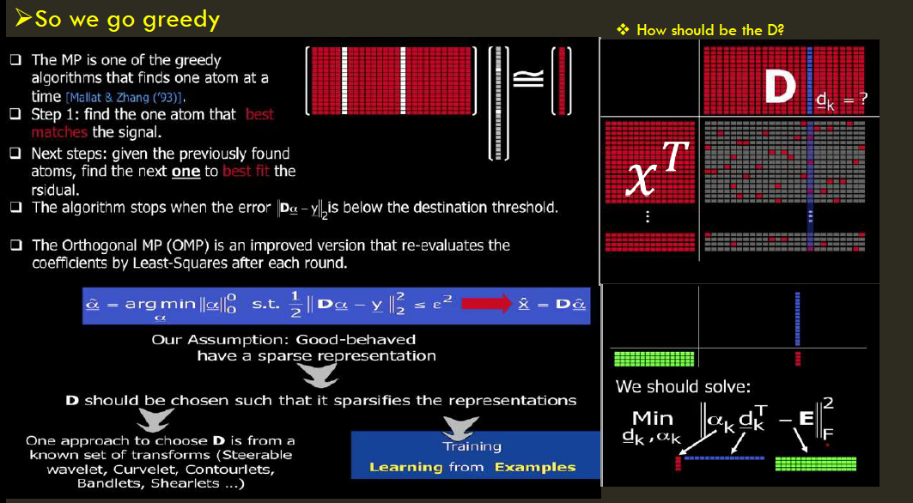
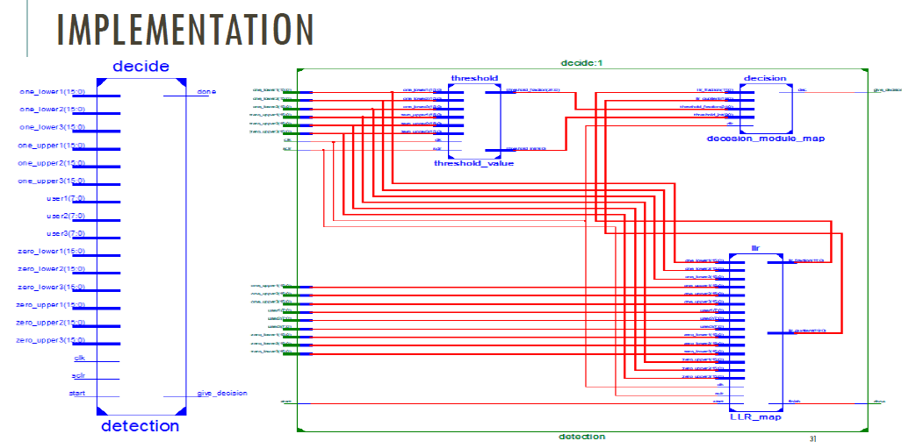

# RESOURCE-ALLOCATION-FOR-UNDERLYING-DSA-BASED-HOLE-DETECTOR-
abstract:
Since Cognitive radio (CR) has emerged as a promising solution to the problem of spectrum underutilization. In CR, spectrum sensing is a key feature. It enables the cognitive user or secondary user (SU) to detect spectrum holes and ensure non-interference to primary communication .a multi-objective algorithms is used to design efficient spectrum sensing and and power allocation techniques to maximize the throughputs and minimize the interferences of the network. DSA scheme based on MOS which performs integrated traffic of different types. The presented scheme maximizes the overall MOS through a reinforcement learning for a system where primary users coexist with secondary users accessing the same frequency band of interest Evolutionary algorithms (EA), like genetic algorithms (GA), are search-and-optimization techniques that work on a principle inspired by the natural evolution theory of Darwin. Inspired by models of adaptation in natural systems that combine the evolutionary adaptation of a population with individual learning within the lifetimes of its members which are the fittest.

_____________________________________________________________________________
problem statement:
The development of the IEEE 802.22 WRAN standard using white  spaces in the television(TV) frequency spectrum is aimed at using cognitive radio (CR) techniques to allow sharing of geographically unused spectrum allocated to the television broadcast service. However, how to efficiently and reasonably select the network and allocate idle spectrum resources to meet the low cost and large traffic demand of users is a difficult problem in the case of dynamic coupling with multiple heterogeneous primary networks overlapping coverage and diversified user requirements thus, Current communication  infrastructure is very hard to be up graded, because the current standards restricts the development so for more advances communication systems, So new research initiatives , such as Virtualization, Software defined network and Software defined radio have raised . The rapid growth in wireless communication has contributed to a huge demand on the deployment of new wireless services , However the current fixed spectrum assignment policy results in poor spectrum utilization . To address this problem, mean opinion score (MOS) has become a widely used metric in a multi-heterogeneous network dense deployment and convergence environment, not only because it reflects the subjective quality experience of end users but it also provides a common quality assessment metric for traffic of different types .The main process called dynamic spectrum access based hole detection ,The detection performance can be determined by two metrics : probability of detection(pd) which denotes the probability of declare that the PU is present when spectrum is indeed occupied by PU, probability of false alarm Pfa which denotes declare that the PU is present when spectrum is free .Many factors in practice such as multi path fading ,shadowing and receiver uncertainty problems may significantly compromise the detection performance .To maximize the throughputs of secondary users and minimize the interferences to primary users, it requires for a joint determination of the sensing and transmission parameters of the secondary users, such as sensing times, decision threshold vectors, and power allocation vectors. There is a conflict between these two objectives, thus a multi-objective optimization problem is introduced. The proposed algorithm evolutionarily learns to find optimal spectrum sensing times, decision threshold vectors, and power allocation vectors to maximize the averaged opportunistic throughput and minimize the averaged interference (or maximize the averaged transmission gain) of the cognitive network.

______________________________________________________________________________________________
methodology:

1.Sensing System: the process of determining the spectrum holes start with cooperative spectrum sensing
Using energy detector method due to it’s simplicity and require no prior knowledge of Pu signal  
Proposed Work: Every SU sense wideband spectrum and compress the signal using sparse binary algorithm, and report it to FC m. all reported signals are jointly recovered using sparse Bayesian learning (M-SBL) Algorithm 

_____________________________
2.Data fusion and Hypothesis testing: it is a process of combining a local sensing data for testing, Cr can transmit the entire local sensing sample so the complete local statistics for this soft decision can achieve the best detection .
Proposed Work:, Sensing time can be minimized by using the sequential probability ratio test (SPRT)  .In this method, the FC  sequentially accumulates the log-likelihood statistics from cooperating CR users and determines when to stop taking  more sequential observations and make a cooperative decision.
___________________________________
3.User Selection: The selection of CR users for cooperative sensing plays a key role in determining the  performance of cooperative sensing because it can be utilized to improve cooperative gain and address the overhead  issues.
Proposed Work: two important performance parameters, cooperative gain and  cooperative overhead. . In user selection FC  choose CRs with best environment to be cooperate., we can link SNR with relative Mean Square Error (r-MSE)., is determined to ensure the successful  reconstruction shown in fig.7 , and v is set to guarantee the sufficient accuracy of reconstruction error estimation. the proposed  estimated reconstruction error is defined as: Eq .1  𝒆̂ =‖𝜱𝒗𝒙̂ − 𝒚𝒗‖𝟐.

____________________________________________________

4.Multi-onjective model  : Its process is to convert the selected users into N Pop OF  chromosomes in population P , each chromosome consists of Q+2*Q*Nc genes .
Proposed Work: evaluate objectives for each chromosome , we search for optimal sensing times decision threshold , and power allocation vectors , the best S chromosome is selected from non dominated POP , then come with mutation and crossover operations , to generate offspring in each evolutionary loop  
_____________________________________________________________
5.Q-learning algorithm: Each generated offspring learns online in its environment and conducts a search into the finite discrete space of candidate target of SINR ,
Proposed Work: measuring the MOS of the data traffic , depending on the evaluate Q tables , using Bellman equation For different cases of similar and dissimilar data traffic .

__________________________________________________

///results:

System configurations and assumptions: 
1- Only three users will cooperate to generate the final decision.
2- Each sample of each user signal is 8 bits. 
3- Number of samples for each signal that used in each detection cycle is 32 samples. 
4- Probability of false alarm ( PFA ) used is 0.01. 
5- In each cycle the system receives other 10 signals are divided into 2 groups of five signals, the first group is the selection vectors received from the secondary users and the second group is generated after the reconstruction process (for selection not detection). 

